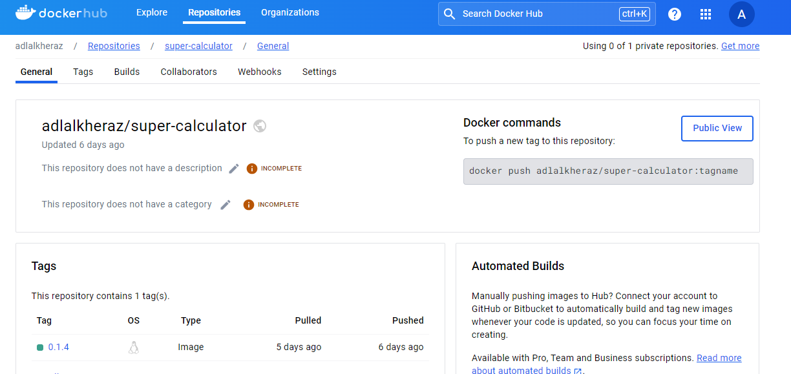

# Workflows

## dependabot.yml

Ce fichier de configuration pour Dependabot automatise la mise à jour quotidienne des dépendances pour les écosystèmes Go (gomod) et Docker. Il spécifie que les mises à jour doivent être vérifiées tous les jours pour les packages situés à la racine du projet (/).

## release.yml

Ce fichier automatise la publication des versions en utilisant GoReleaser et la gestion des images Docker à chaque push sur un tag de version. Il inclut des étapes pour configurer Go, extraire les tags, se connecter à Docker Hub, construire et pousser les images Docker.

## test-workflow.yml

Ce fichier configure un workflow GitHub Actions qui exécute des tests automatisés à chaque push. Il utilise une matrice pour tester le code avec les versions 1.17, 1.18, et 1.19 de Go sur un environnement ubuntu-latest. Les étapes incluent le checkout du code, la configuration de la version de Go, l'installation des dépendances et l'exécution des tests.

## semgrep.yml

Ce fichier configure un workflow de linting qui s'exécute sur les événements workflow_dispatch, pull_request et les pushs sur la branche master pour le fichier .github/workflows/semgrep.yml. Il comporte trois jobs distincts pour vérifier la qualité du code :

### semgrep

Utilise l'image Docker returntocorp/semgrep pour analyser le code avec Semgrep.
S'exécute sur ubuntu-20.04 et utilise le jeton Semgrep pour l'authentification.

### hadolint

Utilise hadolint/hadolint-action@v3.1.0 pour analyser le Dockerfile.
S'exécute sur ubuntu-latest.

### super-linter

Utilise super-linter/super-linter@v6.6.0 pour effectuer diverses vérifications de linting.
S'exécute sur ubuntu-latest uniquement pour les pull requests.
Vérifie tous les fichiers en utilisant un checkout avec fetch-depth: 0 pour accéder à tout l'historique du dépôt.

Le workflow garantit que le code respecte les normes de qualité avant d'être fusionné ou déployé.
Images

## Création de l'image après un push réussi

## Création du token nécessaire pour effectuer des pushs dans Docker Hub

## Interface de Semgrep liée à notre dépôt GitHub

## Les secrets nécessaires pour le bon fonctionnement des workflows

